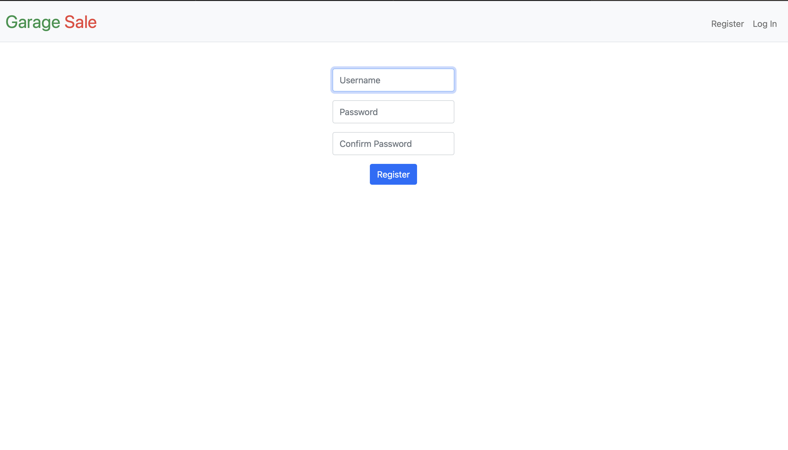
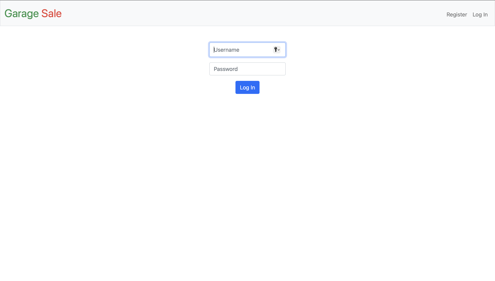
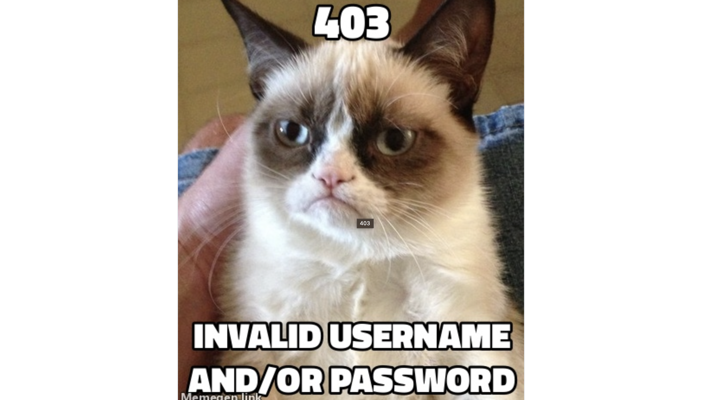
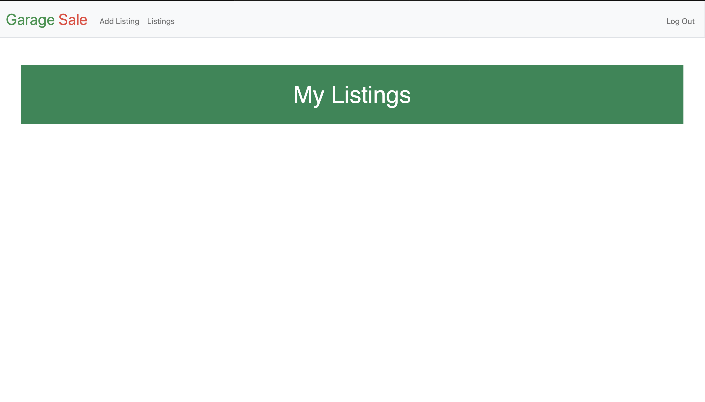
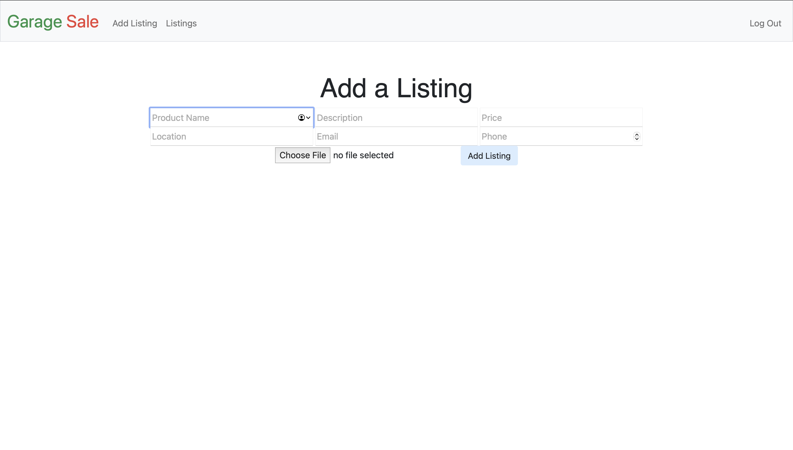
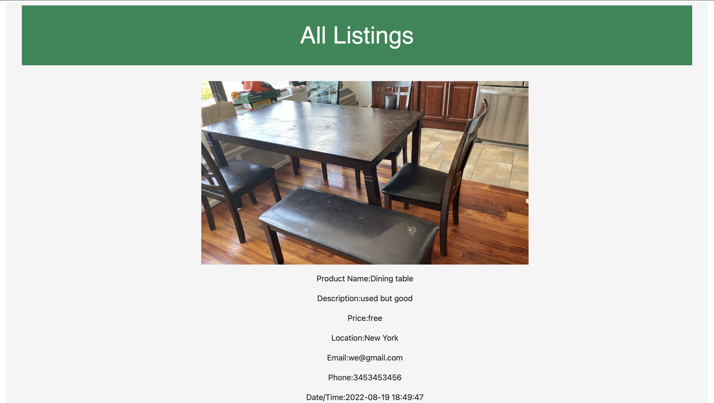

# GARAGE SALE
#### Video Demo:  <https://youtu.be/ZDyV62YtwDA>
#### Description:

My Final Project name is Garage Sale.I have implemented a website via which users can “buy” and “sell” products.An online marketplace where we can sell,buy things or we can freely give away products.When i say products which can be used or new.
I am using the CS50 Codespace to implement this project.
project.db is a SQLite database with two tables, users, that has three columns: id, username and hash.listing which has nine columns:id, user_id, productname, description, price, location, email, phone, time.
In the static directory is a styles.css file containing the CSS code for this web application.and uploads folder too where we store static images.
the user can upload image .and the new images are on top ,new listings are on top...because they are group by time and order by DESC.
image file name is stored in databasr datatype is VARCHAR(50)
In the templates directory,there are seven html files that will be rendered when the user views the web application.
 In apology.html, meanwhile, is a template for an apology. apology function in helpers.py took two arguments: message, which was passed to render_template as the value of bottom, and, optionally, code, which was passed to render_template as the value of top.
 Index.html file that will be rendered when the user views the web application.The main block contains a heading "My Listings"in this page the user can view a table which again has five columns: product name, description,price,image, date/time.this page contains the users own listing.
layout.html it comes with a fancy, mobile-friendly “navbar” (navigation bar), also based on Bootstrap. it defines a block, main, inside of which templates (including apology.html and login.html) shall go. It also includes support for Flask’s message flashing so that you can relay messages from one route to another for the user to see.
In login.html is, essentially, just an HTML form, stylized with Bootstrap.this form asks for users username and password.
register.html that’s quite similar to login.html.again html form asking the user to register before using this web app,Anyone can open an account for free.needs a username and password.Require users’ passwords to have some number of upper/lower case letters, numbers, and/or symbols.
In addlisting.html again a HTML form. The form should let users type in a productname, description about the product,contact details email,phone,price,location there is one submit button add listing.
listing.html user can view a table which again has eight columns: product name, description, email,price,location,image, phone, date/time.this page contains all listing made by the user and others on this website.
requirements.txt. That file simply prescribes the packages on which this app will depend.
helpers.py there’s the implementation of apology.it ultimately renders a template, apology.html. It also happens to define within itself another function, escape, that it simply uses to replace special characters in apologies. By defining escape inside of apology, we’ve scoped the former to the latter alone; no other functions will be able (or need) to call it.
Next in the file is login_required.how a function can return another function, here’s an example!
In app.py Atop the file are a bunch of imports,After configuring Flask, this file disables caching of responses (provided you’re in debugging mode, which you are by default in your code50 codespace), lest you make a change to some file but your browser not notice. It then further configures Flask to store sessions on the local filesystem (i.e., disk) as opposed to storing them inside of (digitally signed) cookies, which is Flask’s default. The file then configures CS50’s SQL module to use project.db.
Thereafter are a whole bunch of routes, most routes are “decorated” with @login_required (a function defined in helpers.py too). That decorator ensures that, if a user tries to visit any of those routes, he or she will first be redirected to login so as to log in.most routes support GET and POST. Even so, most of them (for now!) simply return an “apology,”
In app.py, you’ll find the start of a Flask web application.
implementation of login: uses db.execute (from CS50’s library) to query project.db. And  it uses check_password_hash to compare hashes of users’ passwords. Finally,login “remembers” that a user is logged in by storing his or her user_id, an INTEGER, in session. That way, any of this file’s routes can check which user, if any, is logged in.
The application has one route (/) that accepts both POST requests (after the if) and GET requests (after the else).When the / route is requested via POST, the user is redirected back to / via GET.
implemented register in such a way that it allows a user to register for an account via a form.Require that a user input a username, implemented as a text field whose name is username. Render an apology if the user’s input is blank or the username already exists.
Require that a user input a password, implemented as a text field whose name is password, and then that same password again, implemented as a text field whose name is confirmation. Render an apology if either input is blank or the passwords do not match.
Submit the user’s input via POST to /register.INSERT the new user into users, storing a hash of the user’s password, not the password itself. Hash the user’s password with generate_password_hash
implemented index in such a way that it displays an HTML table summarizing, for the user currently logged in,productname,image, description, time.
implemented addlisting in such a way that it displays an HTML form ,Require that a user input a product name,description of the product,image,user contact details such as email and phone.Submit the user’s input via POST to /addlisting.INSERT these details in project.db database listing column.the user can upload an image of the product.
implemented listings in such a way that it displays an HTML table summarizing,productname, description, email, phone,image, time.
 logout simply clears session, effectively logging a user out.
 Uploading Files:uploading images:A <form> tag is marked with enctype=multipart/form-data and an "input type=file" is placed in that form.The application accesses the file from the files dictionary on the request object.use the save() method of the file to save the file permanently somewhere on the filesystem.The UPLOAD_FOLDER is where we will store the uploaded files and the ALLOWED_EXTENSIONS is the set of allowed file extensions.Why do we limit the extensions that are allowed? You probably don’t want your users to be able to upload everything there if the server is directly sending out the data to the client. That way you can make sure that users are not able to upload HTML files that would cause XSS problems.
 Next the functions that check if an extension is valid and that uploads the file and redirects the user to the URL for the uploaded file:
 So what does that secure_filename() function actually do? Now the problem is that there is that principle called “never trust user input”. This is also true for the filename of an uploaded file. All submitted form data can be forged, and filenames can be dangerous. For the moment just remember: always use that function to secure a filename before storing it directly on the filesystem.
 We want to be able to serve the uploaded files so they can be downloaded by users. We’ll define a download_file view to serve files in the upload folder by name. url_for("download_file", name=name) generates download URLs.
 By default Flask will happily accept file uploads with an unlimited amount of memory, but you can limit that by setting the MAX_CONTENT_LENGTH config key:
